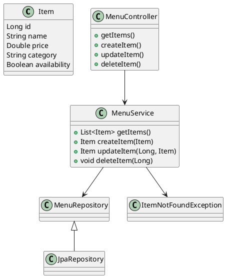
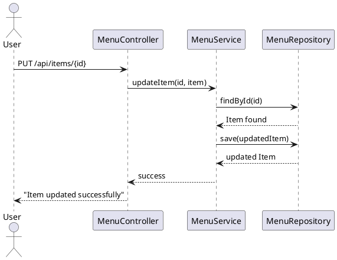

# **📘 Menu Management API – Spring Boot**

A RESTful API for managing restaurant menu items.
Supports CRUD operations with validation, custom exceptions, structured responses, UML diagrams, and Postman documentation.

---

## **👤 Author**

**Bhuvaneshwar Ts**
📧 **bhuvaneshwarts1@gmail.com**

---

# **📁 Project Structure**

```
Menu-Management/
│
├── src/main/java/com/example/Menu/Management/
│   ├── MenuManagementApplication.java
│   │
│   ├── controller/
│   │   └── MenuController.java
│   │
│   ├── service/
│   │   └── MenuService.java
│   │
│   ├── repository/
│   │   └── MenuRepository.java
│   │
│   ├── model/
│   │   └── Item.java
│   │
│   ├── exceptions/
│   │   ├── ItemNotFoundException.java
│   │   └── GlobalExceptionHandler.java (optional improvement)
│   │
│   ├── dto/ (optional future expansion)
│   ├── config/ (optional for CORS)
│
├── src/main/resources/
│   ├── application.properties
│   └── data.sql (optional)
│
├── pom.xml
├── README.md
└── .gitignore
```

---

# **🚀 Setup Instructions**

## **1️⃣ Requirements**

* Java **17+**
* Maven **3.8+**
* Spring Boot **3.x**
* Any IDE (IntelliJ recommended)

---

## **2️⃣ Clone the Project**

```bash
git clone https://github.com/your-repo/menu-management.git
cd menu-management
```

---

## **3️⃣ Build and Run**

Using Maven:

```bash
mvn clean install
mvn spring-boot:run
```

Or run directly from IDE.

---

## **4️⃣ Application URL**

```
http://localhost:8080
```

---

# **📚 API Documentation**

Base URL:

```
/api/items
```

---

# **1️⃣ Get All Items**

### **GET /api/items**

#### ✔ Sample Response (200 OK)

```json
[
  {
    "id": 1,
    "name": "Burger",
    "price": 120,
    "category": "Fast Food",
    "availability": true
  }
]
```

---

# **2️⃣ Create Item**

### **POST /api/items**

#### 📤 Request Body

```json
{
  "name": "Pizza",
  "price": 250,
  "category": "Italian",
  "availability": true
}
```

#### ✔ Response (201 Created)

```json
{
  "id": 2,
  "name": "Pizza",
  "price": 250,
  "category": "Italian",
  "availability": true
}
```

#### ❌ Validation Error (400 Bad Request)

```json
{
  "name": "Name cannot be blank",
  "price": "Price amount is invalid"
}
```

---

# **3️⃣ Update Item**

### **PUT /api/items/{id}**

#### 📤 Request

```
PUT /api/items/2
```

```json
{
  "id": 2,
  "name": "Veg Pizza",
  "price": 270,
  "category": "Italian",
  "availability": true
}
```

#### ✔ Response (200 OK)

```json
"Item updated successfully"
```

---

# **4️⃣ Delete Item**

### **DELETE /api/items/{id}**

#### ✔ Response (200 OK)

```json
"Item deleted successfully"
```

---

# **📌 Validation Rules**

| Field        | Rule                |
| ------------ | ------------------- |
| name         | @NotNull, @NotBlank |
| price        | @Min(1)             |
| category     | optional            |
| availability | optional            |

---

# **⚠️ Exception Handling**

### **400 Bad Request – Validation Errors**

Handled by:

```java
@ExceptionHandler(MethodArgumentNotValidException.class)
```

### **404 Not Found – Item Missing**

Thrown manually:

```java
throw new ItemNotFoundException("Item not found");
```

---

# **📦 Technologies Used**

* Spring Boot 3
* Spring Web (REST)
* Spring Data JPA
* Hibernate
* Jakarta Validation
* Lombok
* Maven

---

# **📤 Postman Collection (Importable)**

Copy into Postman → *Import → Raw Text*

```json
{
  "info": {
    "name": "Menu Management API",
    "_postman_id": "menu-management-1234",
    "description": "Postman collection for Menu Management App",
    "schema": "https://schema.getpostman.com/json/collection/v2.1.0/collection.json"
  },
  "item": [
    {
      "name": "Get All Items",
      "request": {
        "method": "GET",
        "header": [],
        "url": {
          "raw": "http://localhost:8080/api/items",
          "protocol": "http",
          "host": ["localhost"],
          "port": "8080",
          "path": ["api", "items"]
        }
      }
    },
    {
      "name": "Create Item",
      "request": {
        "method": "POST",
        "header": [
          { "key": "Content-Type", "value": "application/json" }
        ],
        "body": {
          "mode": "raw",
          "raw": "{\n    \"name\": \"Pizza\",\n    \"price\": 250,\n    \"category\": \"Italian\",\n    \"availability\": true\n}"
        },
        "url": {
          "raw": "http://localhost:8080/api/items",
          "protocol": "http",
          "host": ["localhost"],
          "port": "8080",
          "path": ["api", "items"]
        }
      }
    },
    {
      "name": "Update Item",
      "request": {
        "method": "PUT",
        "header": [
          { "key": "Content-Type", "value": "application/json" }
        ],
        "body": {
          "mode": "raw",
          "raw": "{\n    \"id\": 1,\n    \"name\": \"Updated Pizza\",\n    \"price\": 300,\n    \"category\": \"Italian\",\n    \"availability\": false\n}"
        },
        "url": {
          "raw": "http://localhost:8080/api/items/1",
          "protocol": "http",
          "host": ["localhost"],
          "port": "8080",
          "path": ["api", "items", "1"]
        }
      }
    },
    {
      "name": "Delete Item",
      "request": {
        "method": "DELETE",
        "header": [],
        "url": {
          "raw": "http://localhost:8080/api/items/1",
          "protocol": "http",
          "host": ["localhost"],
          "port": "8080",
          "path": ["api", "items", "1"]
        }
      }
    }
  ]
}
```

---

# **🧩 UML DIAGRAMS**

## **1️⃣ Class Diagram (ASCII)**

```
+------------------+
|      Item        |
+------------------+
| id: Long         |
| name: String     |
| price: Double    |
| category: String |
| availability: Boolean |
+------------------+

+----------------------+
|   MenuRepository     |
+----------------------+

+----------------------+
|     MenuService      |
+----------------------+
| + getItems()         |
| + createItem()       |
| + updateItem()       |
| + deleteItem()       |
+----------------------+

+----------------------+
|   MenuController     |
+----------------------+
```

---

## **2️⃣ Class Diagram (PlantUML)**



---

## **3️⃣ Sequence Diagram (PlantUML)**



